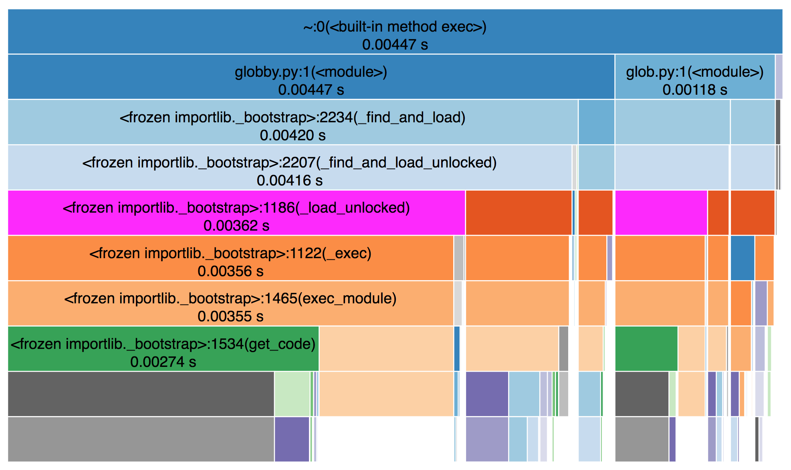
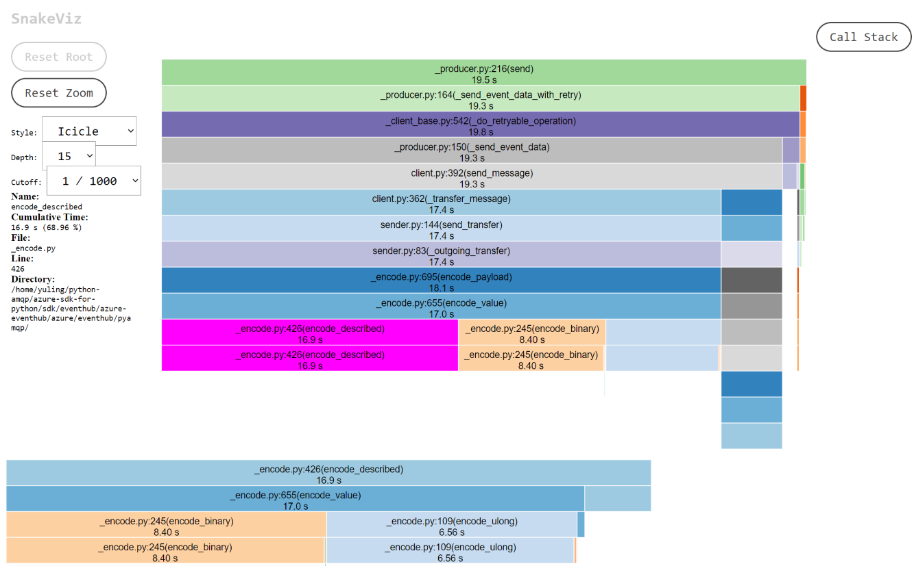

# PythonPerfTalk
Notes and samples for Python performance talk

First Session: Pyamqp
- Anna: Why should we care about perf?
- Anna: When should we care about perf?
-   Pyamqp: Considerations on multiple levels: Maximizing TCP connection socket throughput, calcualtion of decode/encoding of messages, crtitical path

- Adam: How to define perf for your project? Throughput? What do you want to measure?
-   Pyamqp: message throughput, relates to above point about multiple scopes: very low-level, vs end-to-end
- Adam: How to perf test your project: profiler, timeit
-   Pyamqp: demo for how we write tests, profiling the code, comparing functions using timeit etc

- Anna: How to write performant python: lists/dicts vs classes, call methods vs if-statements: Perfomant syntax
-   Pyamqp: Use encoder/decoder as a working example of how we iterated on it for perf
-   Emphasis on being an iterative process - each time shaving off only miliseconds.

- Adam: How to balance perf perf considerations with modular/readable code - lots of trade-offs!
-   Pyamqp: Show how unreadable the encode/decoder code become: this becomes difficult to maintain, onboard new devs. 
-   Can compensate be heavily commenting code to a certain extent.
-   Is the unreadable code worth it? For Pyamqp probably yes - if so, how can we mitigate the tradeoffs as much as possible?
-   For another - less performance-dependent project, maybe it's not worth it, and finding a balance between readable and performant code
-   is important.


Second Session: Perf in Azure SDKs: 
- End-to-end process for perf testing a new Azure SDK
-   What questions to ask? Is perf important for this lib? What do we want to measure? etc
-   Azure perf framework - what this offers and how to write tests for it
-   How can we apply the learnings for Session 1. to improve the perf of an SDK

- CPython vs Pypy (Let's leave this for the second session to allow us both to research ;) )
-   Recap previous discussions on syntax choices and testing - what changes between CPython vs Pypy?
-   Are there syntax choices/structural desgins that work better in one vs the other
-   What does this mean for your project? i.e. how many people are actually using Pypy, and what for?


# Performant Python - Part 1.

## Why should we care about perf?
- Python does not have a reputation as a 'performant' language.
- Consensus that if you want high-performance, you would select an alternative language.

BUT
- Customers will often inherit their project/framework/infrastructure, and may not have the option to rewrite in a different language.
- Just because performance may not be the primary reason a customer selects to work in Python, does not mean that it's inconsequential.
- Depending on how it's used, Python can actually be performant - and not tapping into this can be a frustration for customers.

## When should we care about perf?

As mentioned, Python can be utilized in performant ways - but to do so can often result in trade-offs regarding the style, structure and readability of the code, which we will revisit in more detail later.
Making projects performant also has a significant dev/time cost associated with it. 
Lastly, perf is considerably less important in many areas.
In short - we should focus out efforts on specific areas where we want to drive performance. Other areas will be driven by different motivations, for example testability, maintainability, scalbility etc.

What factors should we use to determine whether a project, or part of a project, should be prioritized for performance?
- Start with the service:
  - Does the service even allow high traffic throughput? Is it throttled? And if so, is that end-user configurable (e.g. by upgrading to a premium tier)?
  For example, most ARM services will only allow 1200 writes per sub per hour, so fine tuning an SDK for high volume of requests might be wasted effort.
  - How do consumers use the service? Is this a management-style service, where requests will be infrequent, setting-up and maintaining resources? Or is this a service with constant ongoing requests? Is data being moved around?
  Examples include messaging services and storage.
  What applications are customers buiding around these APIs? Who are their customers?
  Questions like this can help determine whether the SDK as a whole should make performance a priority, as it will likely be a consideration for customers of the service.
- Is the code in question critical path and highly reused? If so, regardless of the 'perf considerations' of the SDK as a whole, we should spend some time ensuring that high traffic portions of an SDK have be analysed and bottlenecks minimized as much as possible.
Examples include the Core pipeline, policy implementations.
- Focus on areas of the code that will be used frequently during the running of an application - e.g. serializing and deserializing requests and responses. Due to the volume of usage, making these areas performant will have more impact on customers than fining tuning an expensive utility that is only run once during the construction of a Client.

## What do a need to look at when making as SDK 'performant'?

There are different aspects to performance, depending on the nature of the SDK, or project in question - Adam will dig into this more when he talks about defining what perf means in relation to a specific project, what actually needs to be measured, and how to measure that.

The first one we'll encounter, and likely one that, as SDK developers, we'd ultimately spend most time on:
- Efficiency of the critical path: How long does it take for us to build and send the request payload, then unpack and deliver the response. This is fairly ubiquitous across all our SDKs (largely driven by Core), and therefore should always be a consideration for an SDK that we publish (which is why perf tests are now a GA requirement). This is largely about CPU time. However memory allocation is also a consideration. 
This presentation wont look specifically at minimizing memory footprint, however if CPython is constantly reallocating memory that can also be expensive.
- How well the SDK can maximize I/O, network throughput. This one is primarily driven by the scenarios in which the SDK will be used. Two levels involved here: how efficiently is the socket being utilized, and how well has the SDK been structured/designed to facilitate high-volume requests (e.g. multi-thread/process-able). The former is less within our control due to use of 3rd-party transport layers, however is a big consideration for the Pyamqp project where we own the transport implementation.
- There are two primary dimensions to perf testing code, which you'll see when Adam demonstrates profiling:
 1. How long does this piece of code take to run?
 An expensive function might be fine if it's only run once per request
 2. How many times is it run?
 An inexpensive function might seem fine, but cumulitively causes a problem if it's run 1000 times per request.

How can we make each function as efficient as possible?
Can we separate out expensive parts to run fewer times?
Can we restructure things to run fewer times?

# Adams first section

## Performance metrics

### Quiz: Which one(s) should be the performance metric?

#### Case 1: Upload many local files to the Storage Blob

What're the metrics we should use here?

- A. Disk usage
- B. Networking bandwidth usage
- C. Memory usage
- D. Latency
- E. Throughput

#### Case 2: Send 1 Billion Events to Event Hubs

What're the metrics we should use here:

- A. Disk Usage
- B. Networking bandwidth usage
- C. Memory usage
- D. Latency
- E. Throughput
- F. How fast Adam is losing his hair

### Identiyfing metrics

There is no single answer, you may need to cover mutiple layers from end to end scenario to low level components to analyze the program.

Common metrics:
- Throughput: How much amount of work could be done in a certain period of time (e.g. 10 ops/seconds)
- Response time/latency: How long it takes from performing a request until receiving the response (e.g. 40 ms)
- Resource allocation: CPU/Memory/Disk/Network Bandwidth Usage (e.g. 10K memory)

### Identifying success criteria

- If there's already a baseline, it should be straightforward.
- If there's no baseline, we could start defining our own baseline.

> 1. Be aware of limitation of the service/hardware, check the service limit qutoas and limits, the capability of the hardware.

> 2. Do control variables, be aware of the various configs that might be impacting your perf result.

#### Case Study: Event Hubs and Python AMQP, Throughput is the top priority

**Metrics:**

- E2E Scenario
  - Event Hub Sending and Receiving: 10k events/second, 100k bytes/second

- Python AMQP
  - Top layer:
    - Sending and Receiving: 20k events/second, 200k bytes/second
  - Middle layer:
    - Connection/Session/Link: timed used to process an AMQP frame, 0.05 seconds per AMQP frame
  - Bottom layer:
    - Encode/Decode: timed used to encode/decode a Python object/AMQP frame, 0.05 seconds per AMQP frame or Python object
    - Networking transport: 500k bytes/second

**Sccuess criteria:**
- match/surpass uAMQP in sending and receiving in the E2E Scenario

### Summary

- Identify the metrics, think about the E2E scenario
- Identify the success criteria, what should be reasonble number?
- Python AMQP: throughput and match/surpass uAMQP

## Execute perf test, analyze and improve the performance

### Tools for analyzing your program

#### DIY

```python
import time

start_time = time.time()

for i in range(10000):
    "-".join(str(n) for n in range(100))   

end_time = time.time()
perf = (end_time - start_time) / 10000
print(perf)
```

#### timeit — Measure execution time of small code snippets

> [This module provides a simple way to time small bits of Python code.](https://docs.python.org/3/library/timeit.html
)

```python
import timeit
timeit.timeit('"-".join(str(n) for n in range(100))', number=10000)
# returns the time it takes to execute the main statement a number of time
# 0.3018611848820001
```

- Python AMQP sample

```python
import logging
import timeit


def test_timeit_receive_message_batch():
    SETUP_CODE = '''
# settings
receive_client = ReceiveClient(hostname, source, sas_auth, idle_timeout=10, link_credit=300)
receive_client.open()
while not receive_client.client_ready():
    time.sleep(0.05)
        '''

    TEST_CODE = '''
receive_client.receive_message_batch(max_batch_size=1000)
    '''

    time = timeit.timeit(TEST_CODE, setup=SETUP_CODE, number=20)
    # we could use the time for future perf regression test
    logging.info(time)


if __name__ == '__main__':
    test_timeit_receive_message_batch()
```

#### The Python Profilers

> [cProfile and profile provide deterministic profiling of Python programs. A profile is a set of statistics that describes how often and for how long various parts of the program executed. ](https://docs.python.org/3/library/profile.html)


```python
import cProfile
import re
cProfile.run('re.compile("foo|bar")')
```
```bash
      197 function calls (192 primitive calls) in 0.002 seconds

Ordered by: standard name

ncalls  tottime  percall  cumtime  percall filename:lineno(function)
     1    0.000    0.000    0.001    0.001 <string>:1(<module>)
     1    0.000    0.000    0.001    0.001 re.py:212(compile)
     1    0.000    0.000    0.001    0.001 re.py:268(_compile)
     1    0.000    0.000    0.000    0.000 sre_compile.py:172(_compile_charset)
     1    0.000    0.000    0.000    0.000 sre_compile.py:201(_optimize_charset)
     4    0.000    0.000    0.000    0.000 sre_compile.py:25(_identityfunction)
   3/1    0.000    0.000    0.000    0.000 sre_compile.py:33(_compile)
```

- To profile a standalone script and get the statistic

```bash
python -m cProfile [-o output_file] [-s sort_order] (-m module | myscript.py)
```

```python
import pstats
from pstats import SortKey
p = pstats.Stats('restats')
p.strip_dirs().sort_stats(-1).print_stats()
```

####  visualize cprofiler results

[snakeviz](https://github.com/jiffyclub/snakeviz/)




### Case study: Python AMQP Producer Perf Improvement

#### 1. Use Python cprofiler + snakeviz find find out bottleneck



**encode_binary seems to be our bottleneck!**


#### 2. Analyze where is the bottleneck

Analyze the lines of code that might be the bottleneck

```python

def _construct(byte, construct):
    # type: (bytes, bool) -> bytes
    return byte if construct else b''

def encode_binary(output, value, with_constructor=True, use_smallest=True):
    # type: (bytes, Union[bytes, bytearray], bool, bool)
    """
    <encoding name="vbin8" code="0xa0" category="variable" width="1" label="up to 2^8 - 1 octets of binary data"/>
    <encoding name="vbin32" code="0xb0" category="variable" width="4" label="up to 2^32 - 1 octets of binary data"/>
    """
    length = len(value)
    if use_smallest and length <= 255:
        output += _construct(ConstructorBytes.binary_small, with_constructor)
        output += struct.pack('>B', length)
        return output + value
    try:
        output += _construct(ConstructorBytes.binary_large, with_constructor)
        output += struct.pack('>L', length)
        return output + value
    except struct.error:
        raise ValueError("Binary data to long to encode")
```

#### 3. Use timeit to compare different implementations

```python
import timeit

def test_bytes():
    SETUP_CODE_bytes = '''
output = b""
    '''

    TEST_CODE_bytes = '''
for _ in range(100):
    output += b'a'
    '''
    time_bytes = timeit.timeit(TEST_CODE_bytes, setup=SETUP_CODE_bytes, number=1000)
    print(time_bytes)


def test_bytearry():
    SETUP_CODE_bytearry = '''
output = bytearray()
    '''

    TEST_CODE_bytearry = '''
for _ in range(100):
    output.extend(b'a')
    '''
    time_bytearry = timeit.timeit(TEST_CODE_bytearry, setup=SETUP_CODE_bytearry, number=1000)
    print(time_bytearry)


def test_bytesio():
    SETUP_CODE_bytesio = '''
import io
bytesio = io.BytesIO(b"")
    '''
    TEST_CODE_bytesio = '''
for _ in range(100):
    bytesio.write(b'a')
    '''
    time_bytesio = timeit.timeit(TEST_CODE_bytesio, setup=SETUP_CODE_bytesio, number=1000)
    print(time_bytesio)


test_bytes()
test_bytearry()
test_bytesio()
```

#### 4. Validate the improvement!

- bytearry to replace bytes

```python
def encode_binary(output, value, with_constructor=True, use_smallest=True):
    # type: (bytearray, Union[bytes, bytearray], bool, bool) -> None
    """
    <encoding name="vbin8" code="0xa0" category="variable" width="1" label="up to 2^8 - 1 octets of binary data"/>
    <encoding name="vbin32" code="0xb0" category="variable" width="4" label="up to 2^32 - 1 octets of binary data"/>
    """
    length = len(value)
    if use_smallest and length <= 255:
        output.extend(_construct(ConstructorBytes.binary_small, with_constructor))
        output.extend(struct.pack('>B', length))
        output.extend(value)
        return
    try:
        output.extend(_construct(ConstructorBytes.binary_large, with_constructor))
        output.extend(struct.pack('>L', length))
        output.extend(value)
    except struct.error:
        raise ValueError("Binary data to long to encode")
```

- run perf and compare with the previous implementation


## How to write performant Python - an exploration of CPython

CPython - which we, and most people, use most of the time - is, naturally, built on C.
Therefore, if we understand _how_ C is being used under the surface, we can write our Python code to best utilize C.

### Use built in functions where possible

These are often implemented in C, and therefore will be the fastest version.
Alway check the docs for libraries like itertools before embarking on unique loop traversal - you may find an existing utility that will be faster.
Functools 

### Variables

- Make any regexs precompiled constants.
- Python is faster looking up a local variable than a global one

### Working with str, bytes, bytearray and memoryview

While this presentation doesn't really cover memory usage, understanding how Python is allocation memory for C types can help us be more efficient.


### Classes vs Dicts vs Lists vs Tuples

The underlying Python List object is implemented as a C array. This means that adding items to the front, or middle of a list is more expensive than the simply code implies.
The keyword `in` is highly optimized in Python.

#### Construction
#### Attribute/data access

- A dict lookup is faster than accessing an object attribute
- Accessing a list index is faster than a dict lookup
- In short - _every_ lookup is expensive - if using in loops, consider assinging to a variable beforehand.


### Method calls

- Calling methods is expensive. For critical path - avoid moving code out into many 'utilities'

### if-statements

### loops vs comprehensions

### Checking and error handling

The first iteration of the Pyamqp deserialization was written in a highly defensive - it was written to be very cautious that the payloads received were correctly encoded bytes according to the AMQP protocol specification. This meant that in the event of a failed deserialization, we received highly detailed error messages regarding the nature of the failure.
- This is not a bad approach for a generic AMQP client implementation that is being used with an unknown, possibly unreliable service endpoint. However this Client development is being driven by Azure services, which we can assume will likely have a valid payload 99.8% [citation needed] of the time. This means that we have a heavy overhead to protect us again what should be a very uncommon occurance.
- If we get a nicely detailed error on why a message payload contained invalid bytes - what does this even mean to most customers? A customer of the EH/SB SDK may not know or even be aware of the AMQP protocol, let alone care about incorrect encoding.
- If we remove all the defensive checking and error handling - and simply let errors raise to the surface under a generic failure (e.g. DeserializationError), this is enough to let customer know what part of the process failed. By including additional data - i.e. the payload bytes - on the error object, a support engineer should have everything they need to repro the error and debug it.
- This reduces the deserialization lines of code hugely
- Typical Pythonic coding using AFNP approach to errors - and for Python this is typically less expensive. But be open to a LBYL appraoch - there are situations where attempting and failing are more expensive.


### Python version
- While it's not an important distinction for us, checking your perf results across multiple CPython versions can yeild interesting results - in particular the extremes, e.g. 3.6 vs 3.10.

### Iterative and experimental

Improving Python perf is not a quick process and invovles many iterations. Each iteration may only shave a _tiny_ fraction off the run time. Most iterations will probably go backwards. What helped speed up one SDK, may not work for the next - so profile and iterate will always be a unique experience for each application and its parameters.
However, the more you do it, the more you will instinctively use the most efficient tools.

# Adams second part

## Performance vs Maintenance

> "All problems in computer science can be solved by another level of indirection." [David Wheeler]

> "Most performance problems in computer science can be solved by removing a layer of indirection" [unknown]


### trade-offs

- Indirection Pros:
    - modular/decouple
    - encapsulate detail/complexity
    - easy to maintain/extend/read

- Indirection Cons:
    - performance degradation: additional object creation/method call
    - "An often cited corollary to this is, "...except for the problem of too many layers of indirection."


#### Case Study: Python AMQP Encoder


- Encoder -- current implementation
```python
# _encode.py

_ENCODE_MAP = {
    None: encode_unknown,
    AMQPTypes.null: encode_null,
    AMQPTypes.boolean: encode_boolean,
    AMQPTypes.ubyte: encode_ubyte,
    AMQPTypes.byte: encode_byte,
    # more types
}

def encode_value(output, value, **kwargs):
    # type: (bytearray, Any, Any) -> None
    try:
        _ENCODE_MAP[value[TYPE]](output, value[VALUE], **kwargs)
    except (KeyError, TypeError):
        encode_unknown(output, value, **kwargs)

def encode_null(output, *args, **kwargs):  # pylint: disable=unused-argument
    # type: (bytearray, Any, Any) -> None
    """
    encoding code="0x40" category="fixed" width="0" label="the null value"
    """
    output.extend(ConstructorBytes.null)


if __name__ == '__main__':
    encode.encode_value(output, {"TYPE": "NULL", "VALUE": None})
```

- Alternatively

```python

def get_encode_method_as_per_amqp_type(amqp_type):
    if amqp_type == None:
        return encode_null
    elif amqp_type == AMQPType.boolean:
        return encode_boolean

def encode_value(output, value, **kwargs):
    encode_method = get_encode_method_as_per_amqp_type(value[TYPE])
    return encode_method(output, value[VALUE], **kwargs)

if __name__ == '__main__':
    encode.encode_value(output, {"TYPE": "NULL", "VALUE": None})
```

- Let's add some doc to our current implementation

```python
# _encode.py

def encode_value(output, value, **kwargs):
    # type: (bytearray, Any, Any) -> None
    # value could be dic with key being the amqp type information, value being the python object
    try:
        # we look into the _ENCODE_MAP to retrieve the corresponding encode method for the input AMQP Type wnich is value[TYPE]
        # and then pass the ojbect to be encoded which is value[VALUE] into the encode method
        _ENCODE_MAP[value[TYPE]](output, value[VALUE], **kwargs)
    except (KeyError, TypeError):
        # if value doesn't contain AMQP Type information, we encode based on the python object type
        encode_unknown(output, value, **kwargs)

```

### Summary

- Is the unreadable code worth it?
  - For Pyamqp probably yes - if so, how can we mitigate the tradeoffs as much as possible?
    - Can compensate be heavily commenting code to a certain extent.
  - For another less performance-dependent project, maybe it's not worth it, and finding a balance between readable and performant code is important.